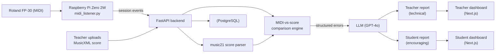

# KeySight — Piano Practice Tracker

An end-to-end system that captures piano practice from a MIDI instrument, compares each performance against the sheet music, and uses an LLM to generate practice feedback tailored separately for the teacher and the student.

Built as a B2B2C SaaS: music teachers upload scores and review AI-generated reports on their students' progress; students get encouraging, plain-language feedback after each session.

## What it does

1. A student plays a piece on a MIDI piano connected to a Raspberry Pi.
2. The Pi captures the MIDI events and streams the session to the backend.
3. The backend compares the performance against the uploaded score (MusicXML) and detects wrong notes, rhythm deviations, and dynamics mismatches.
4. An LLM turns that structured error report into two written reports: a technical one for the teacher and an encouraging one for the student.
5. Both appear in the relevant dashboard, with per-period summaries of progress over time.

## Architecture



## Key capabilities

- **MIDI capture on edge hardware** — a Raspberry Pi listens to a USB-connected piano and bundles practice sessions.
- **Score ingestion** — teachers upload MusicXML (`.xml`, `.musicxml`, `.mxl`); the backend parses it with `music21` into a structured note/key/time-signature/dynamics model.
- **Performance comparison** — a deterministic engine aligns performed MIDI against the score and classifies wrong notes, rhythm errors, and dynamics deviations by measure.
- **LLM-generated feedback** — the structured error report is turned into two audience-specific reports (technical for the teacher, encouraging for the student) via GPT-4o.
- **Period summaries** — weekly/monthly/yearly synthesis of recurring errors and progress trends.
- **Role-based access** — teachers and students authenticate and only see the data they're permitted to.

## Project structure

```text
hardware/   Raspberry Pi MIDI listener and session bundler (see hardware/README.md)
backend/    FastAPI app: auth, sessions, score parsing, MIDI comparison, AI reports
frontend/   Two Next.js dashboards — teacher and student
sheets/     Supporting spreadsheet integration
```

Backend highlights:
```text
backend/
  main.py                     FastAPI app and router wiring
  models.py / schemas.py      SQLAlchemy models and Pydantic schemas
  routers/ai_analysis.py      Score upload, MIDI-vs-score analysis, AI reports, period summaries
  routers/sessions.py         Practice session capture
  routers/auth.py             Authentication
  services/midi_analyzer.py   Deterministic MIDI-vs-score comparison logic
```

## Tech stack

| Layer | Technology |
|---|---|
| Hardware | Raspberry Pi Zero 2W, Roland FP-30, MIDI over USB |
| Backend | Python, FastAPI, SQLAlchemy (async), PostgreSQL |
| Score parsing | music21 |
| AI | OpenAI GPT-4o |
| Frontend | Next.js (teacher and student dashboards) |
| Deployment | Docker, Alembic migrations; see DEPLOYMENT.md |

## Getting started

### Backend
```bash
cd backend
pip install -r requirements.txt
cp .env.example .env   # set DATABASE_URL, OPENAI_API_KEY, etc.
alembic upgrade head
uvicorn main:app --reload
```

### Frontend
Each dashboard is a Next.js app under `frontend/`. Install dependencies and run the dev server for the teacher and student dashboards respectively. Set `NEXT_PUBLIC_API_URL` to your backend URL.

### Hardware
See `hardware/README.md` for wiring the Raspberry Pi to the piano and running `midi_listener.py`.

For production connectivity across the dashboards, backend, and hardware, see `DEPLOYMENT.md`.

## Configuration

Each component ships a safe `.env.example`. Copy it locally and supply your own values — never commit real credentials or production tokens.

**Backend** (`backend/.env`):

| Variable | Purpose |
|---|---|
| `DATABASE_URL` | PostgreSQL connection string |
| `SECRET_KEY` | JWT signing secret |
| `OPENAI_API_KEY` | Optional — required only for AI-generated reports |

**Frontend** (`frontend/*/.env.local`):

| Variable | Purpose |
|---|---|
| `NEXT_PUBLIC_API_URL` | URL of the FastAPI backend |

**Hardware** (environment for `midi_listener.py`):

| Variable | Purpose |
|---|---|
| `API_URL` | Session-ingestion endpoint |
| `DEVICE_ID` | Stable identifier for the connected device |
| `STUDENT_ID` | Optional fallback student identifier |

## Notes

Active practice sessions are held in memory in the current version; a production deployment would move them to a persistent store. See `DEPLOYMENT.md` for details.
