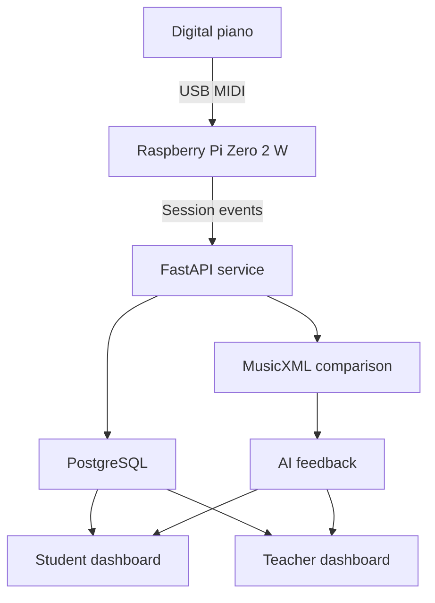

# Frictionless Piano Tracker

A full-stack IoT platform that captures real piano practice through MIDI and turns it into structured, actionable feedback for students and teachers.

## Why this project exists

Practice data is usually invisible. A teacher sees a student once a week, while most of the learning happens between lessons. Manual practice logs add friction and rarely capture what was actually played.

Frictionless Piano Tracker removes that reporting step. A Raspberry Pi connected to a digital piano listens for MIDI events, groups them into practice sessions, and sends them to a cloud platform. Teachers can review progress, compare a performance with uploaded sheet music, and generate tailored feedback. Students receive a simpler, encouraging view of the same practice data.

## What the system does

- Captures notes, timing, velocity, and sustain-pedal events from a USB MIDI piano
- Automatically detects and bundles practice sessions
- Retries failed uploads and preserves unsent sessions locally
- Stores users, pieces, sessions, and reports in PostgreSQL
- Supports separate student and teacher experiences
- Parses MusicXML scores and compares them with recorded MIDI performance
- Produces technical teacher reports and student-friendly coaching with AI
- Runs the Raspberry Pi listener automatically as a systemd service

## Architecture



## Technology

| Layer | Technology |
|---|---|
| Edge device | Raspberry Pi Zero 2 W, Linux, systemd |
| Data capture | Python, Mido, python-rtmidi |
| API | FastAPI, Pydantic, SQLAlchemy |
| Database | PostgreSQL, asyncpg, Alembic |
| Web applications | Next.js, React, TypeScript, Tailwind CSS |
| Music analysis | MIDI, MusicXML, music21 |
| AI layer | OpenAI API |
| Deployment | Docker, Render, Railway, Vercel |

## Repository structure

```text
hardware/                     Raspberry Pi MIDI capture and systemd setup
backend/                      FastAPI API, database models, analysis services
frontend/student-dashboard/   Student practice and feedback experience
frontend/teacher-dashboard/   Teacher monitoring and reporting experience
sheets/                       Sample MIDI and MusicXML files
render.yaml                   Cloud deployment configuration
```

## End-to-end flow

1. A student starts a practice session from the web application.
2. The Raspberry Pi captures MIDI events from the connected piano.
3. Events are bundled into a structured session and uploaded to the API.
4. The backend stores the session and associates it with the student and piece.
5. Uploaded MusicXML is parsed into a comparable score structure.
6. The analysis service identifies timing, note, and performance differences.
7. The AI layer turns those findings into role-specific feedback.
8. Students and teachers review the results in their respective dashboards.

## Local development

### Prerequisites

- Python 3.11
- Node.js 20 or later
- PostgreSQL
- A USB MIDI device for live hardware capture
- An OpenAI API key for AI-generated reports

### 1. Backend

```bash
cd backend
python -m venv .venv
source .venv/bin/activate
pip install -r requirements.txt
cp .env.example .env
uvicorn main:app --reload
```

The health endpoint will be available at `http://localhost:8000/health`.

### 2. Student dashboard

```bash
cd frontend/student-dashboard
npm install
cp .env.example .env.local
npm run dev
```

### 3. Teacher dashboard

```bash
cd frontend/teacher-dashboard
npm install
cp .env.example .env.local
npm run dev -- --port 3001
```

### 4. Raspberry Pi

See [hardware/README.md](hardware/README.md) for installation and systemd instructions. The hardware layer can also be explored without a piano by reading the session payload and retry logic in [hardware/session_bundler.py](hardware/session_bundler.py).

## Configuration

The repository contains safe `.env.example` files. Copy them locally and supply your own values. Never commit credentials or production tokens.

Backend:

| Variable | Purpose |
|---|---|
| `DATABASE_URL` | PostgreSQL connection string |
| `SECRET_KEY` | JWT signing secret |
| `OPENAI_API_KEY` | Optional AI-report generation |

Frontend:

| Variable | Purpose |
|---|---|
| `NEXT_PUBLIC_API_URL` | URL of the FastAPI service |

Hardware:

| Variable | Purpose |
|---|---|
| `API_ENDPOINT` | Session-ingestion endpoint |
| `DEVICE_ID` | Stable identifier for the connected device |
| `STUDENT_ID` | Optional fallback student identifier |

## Engineering decisions

- **Frictionless capture:** practice is recorded at the instrument instead of relying on manual logs.
- **Edge resilience:** failed uploads are written locally and network requests use retries.
- **Role-specific design:** the same underlying data is translated into different teacher and student experiences.
- **Structured analysis before AI:** deterministic MIDI-to-score comparison produces the evidence; AI is used to communicate it clearly.
- **Deployable components:** hardware, API, database, and dashboards can be operated independently.

## Current status

This is a working product prototype. Core MIDI capture, session ingestion, authentication, MusicXML parsing, analysis, dashboards, and AI reporting are implemented.

Areas for continued development include automated tests, offline-session replay, device provisioning, observability, and a guided demo environment.

## Author

Built by [Aviv Gur](https://github.com/avivgur-crypto) as an exploration of how connected hardware, automation, and AI can improve a real-world learning workflow.
